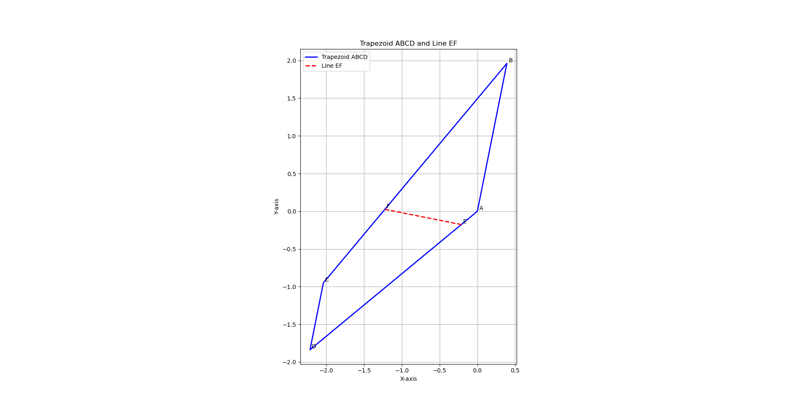
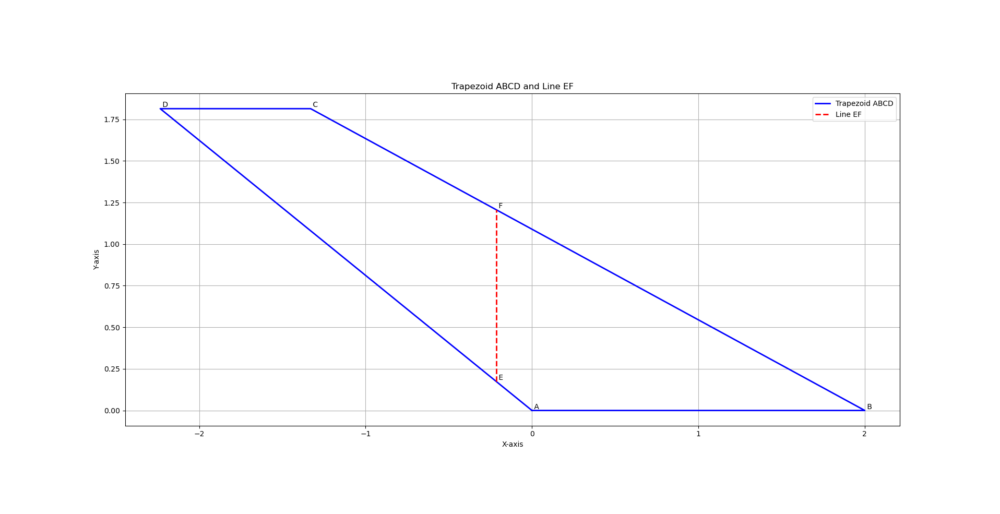
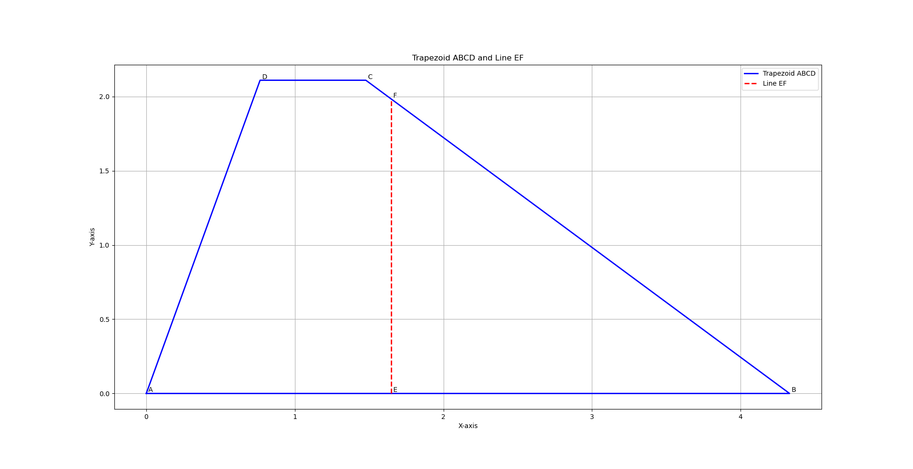

# Kompileerimine

```bash
make
```

Või alternatiivina:  
```bash
g++ -o trapets -std=c++17 main.cpp
```

Jätsin kogu koodi ühte faili, et oleks lihtsam kompileerida ja koodi lugeda.

# Käivitamine
Sisend loetakse standardsisendist  
Sisend on vormingus:  
```
x0 y0 x1 y1 x2 y2 x3 y3
```
Kus (x0, y0), (x1, y1), (x2, y2) ja (x3, y3) on trapetsi tippude koordinaadid A, B, C ja D.  
Trapetsi tipud:  
```
 D--C
/   |
A---B
```

Küljed AB ja DC peavad olema paralleelsed ja kõik tipud peavad olema erinevad. Muid piiranguid ei ole.  

Sisendi näited on kaustas examples.  
Näide:
```bash
./trapets < examples/rotated.txt
```
  
# Väljund
Programm võtab sisendina trapetsi tipud ja arvutab alustega ristuva sirge EF, mis jagab trapetsi kaheks võrdse pindalaga osaks.  
  
Väljund kirjutatakse loetaval kujul standardväljundisse ja ka faili trapezoid.txt  
trapezoid.txt vorming on järgmine:
```
x0 y0 x1 y1 x2 y2 x3 y3
x4 y4 x5 y5
```
Esimene rida on trapetsi tipud A, B, C ja D (sisend).  
Teine rida on trapetsit lõikavate punktide E ja F koordinaadid.

# Visualiseeritud näited




# Lahendus
Trapets pööratakse nii, et alused oleks horisontaalselt.  
Ülesanne on lahendatud kasutades numbrilist meetodit. Analüütiline lahendus on kindlasti olemas, aga oleks arvatavasti võtnud liiga palju aega.  
Defineeritakse funktsioon mis arvutab trapetsit lõikavast sirgest EF vasakule jääva trapetsi ala pindala. Funktsiooni sisendiks on sirge asukoht. Lahutades funktsiooni väärtusest poole trapetsi kogupindalast, on see võimalik lahendada juure leidmise ülesandena (root finding).  
  
Sirgest vasakule jääva osa pindala arvutatakse integraalina funktsioonist `max(0, min(x, x_r(y)) - x_l(y))` üle `y`, kus `x` on sirge EF x-koordinaat `x_l(y)` trapetsi vasaku külje x-koordinaat kõrgusel `y` ja `x_r(y)` on trapetsi parema külje x-koordinaat kõrgusel `y`.  
  
Aega kulus veidi rohkem kui oleks pidanud, aga lahendus on põhjalik. Kõik sisendid mida proovisin andsid õige näiva tulemuse.